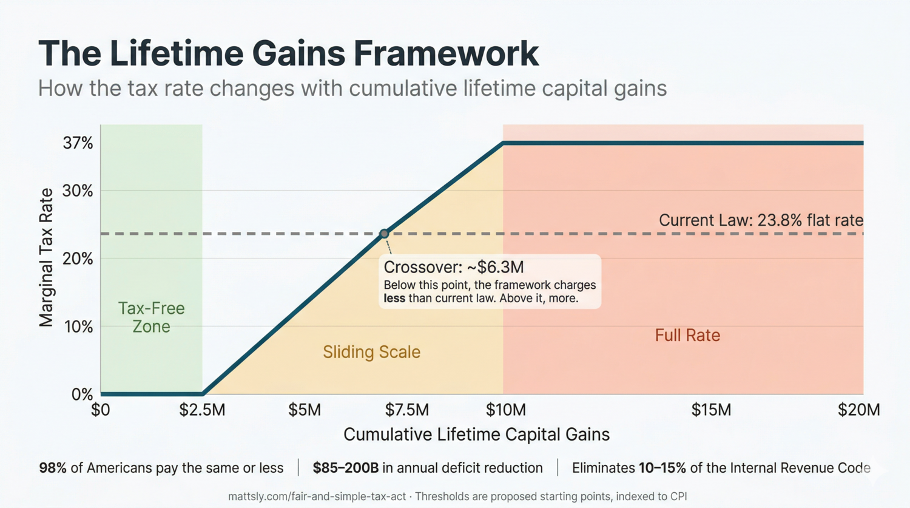

# America's Most Expensive Technical Debt, Part 1: Capital Gains

### A proposal for simple, fair and durable capital gains tax reform that Closes “Buy, Borrow, Die” and Estate Tax evasion loopholes and supports universal wealth building.

*By Matt Sly*

---

Capital gains taxation is one of the most tangled corners of the tax code as well as one of the most consequential. A century of “patches” has produced a web of preferential rates, holding-period rules, exclusions, deferrals, and estate-planning workarounds. Capital gains tax policy enables the machinery behind "buy, borrow, die" (the reason billionaires can pay a lower effective rate than teachers) and creates a quiet distortion of where capital actually flows: investors hold aging assets for decades not because they're the best use of money, but because selling triggers a tax bill that dying doesn't.

So let’s refactor it. Five rules can replace a century of accretion. These rules cut capital gains taxes for 95%+ of Americans, close buy-borrow-die, eliminate roughly 10-15% of the Internal Revenue Code (including the AMT, the NIIT, and the estate tax), and generate an estimated $108 billion per year in net new revenue.

Here we go:

---

## The Capital Gains Refactor: Five Rules

> Note: the specific numbers below are "stakes in the ground." They're open for debate and much less important than the general framework.

**Rule 1: Every American gets a lifetime capital gains exemption.** $2 million per person; $4 million for a married couple. One bucket replaces a dozen narrow exclusions. Any source, any asset type, no qualification tests, no holding-period games. Losses offset gains within the year, same as current law.

**Rule 2: Above the exemption, the rate slides from 0% up to the top income tax rate.** From $2 million to $6 million in cumulative lifetime gains, the rate phases linearly from 0% to the current top marginal rate (currently 37%). Above $6 million, all gains are taxed at that top rate. Two details matter here. First, the top rate is *pegged* to whatever the top marginal income tax rate happens to be. It's not a separate number Congress has to update. Second, the rate applies regardless of the taxpayer's other income. A retiree with $0 W-2 income and $15M in lifetime gains pays the same top rate as a wage earner at $500K. This is what eliminates the preferential rate that lets hedge fund managers pay less than teachers.

**Rule 3: You can't defer gains forever.** Realization happens whenever appreciated wealth changes hands in a way that preserves or transfers its availability for private consumption. Four events trigger realization under this principle: sale, death, gift, and borrowing.

- **Sale.** Unchanged from current law.
- **Death.** Unrealized gains are realized on the decedent's final return. Heirs receive basis at fair market value. This is how [Canada has handled it since 1972](https://www.canada.ca/en/revenue-agency/services/tax/individuals/life-events/doing-taxes-someone-died/prepare-returns/report-income/capital-gains.html). This single change ends stepped-up basis, the provision that currently lets heirs inherit appreciated assets with a clean tax slate and erases a lifetime of untaxed gains.
- **Gift to another individual.** The donor pays tax on unrealized gains at the time of transfer. The recipient gets basis at gift-date market value. (The annual $19K gift exclusion is retained.)
- **Borrowing against appreciated assets.** When you pledge appreciated assets as collateral, the unrealized gain is deemed realized. Basis steps up to prevent double taxation on eventual sale. Mechanics informed by [research from the Yale Budget Lab](https://budgetlab.yale.edu/research/buy-borrow-die-options-reforming-tax-treatment-borrowing-against-appreciated-assets). If the collateral has no unrealized gain (a purchase mortgage on a newly-bought home, for example), the deemed realization is $0.

*Transfers to qualified charities are not realization events. The appreciation exits the private economy. See "What About Charitable Giving?" below for mechanics.*

**Rule 4: Basis is indexed to inflation.** Your cost basis is adjusted by CPI, so you're taxed on real economic gains, not phantom ones. A house bought for $200,000 in 1995 has a CPI-adjusted basis of roughly $400,000 in 2026. Indexing applies symmetrically to gains and losses. The government doesn't get to profit from inflation anymore.

**Rule 5: Roth reform.** Four changes to simplify Roth accounts and close the [Peter Thiel loophole](https://www.propublica.org/article/lord-of-the-roths-how-tech-mogul-peter-thiel-turned-a-retirement-account-for-the-middle-class-into-a-5-billion-dollar-tax-free-piggy-bank), where a hedge fund manager turned a middle-class retirement vehicle into a $5 billion tax shelter:

1. Remove the income cap for direct Roth contributions
2. Raise the annual contribution limit to $15,000 (from $7K/$8K)
3. Cap the total Roth balance at $5 million per person (growth above this continues tax-free, but new contributions freeze)
4. Close the "backdoor Roth" conversion entirely

That's it. Five rules. From these, an extraordinary amount of existing tax infrastructure becomes unnecessary.

*The full mechanics — including the lifetime counter algorithm, transition rules, trust treatment, and complete list of provisions eliminated — are in the [technical specification](./technical_spec.html). When mechanics change, the spec governs.*

---

## What Falls Away

The five rules make entire categories of tax law redundant.

**The Alternative Minimum Tax.** Created in 1969 because [155 wealthy Americans paid zero income tax that year](https://taxfoundation.org/taxedu/glossary/alternative-minimum-tax-amt/). When there are no exclusions to exploit, the AMT's purpose evaporates. It's been functionally gutted for high earners anyway since the 2017 tax cuts, but it still ensnares upper-middle-class families in high-tax states. Good riddance.

**The Net Investment Income Tax.** A 3.8% surtax bolted onto the Affordable Care Act in 2010 to fund Medicare. Under this framework, gains above the exemption are taxed at rates far exceeding 3.8%. The NIIT becomes redundant by design.

**The estate tax.** A tax that looks progressive on paper and fails in practice. The statutory rate is 40%. The effective rate on well-planned estates is typically 10-15% because an entire industry exists to help wealthy families avoid it. Under this framework, death is a realization event and all unrealized gains are taxed on the decedent's final return. The replacement mechanism collects more revenue from large estates with fewer loopholes. (Full argument below in [The Estate Tax Question](#the-estate-tax-question).)

**A wealth tax.** Not currently law, but perennially proposed. This framework delivers the same progressivity a wealth tax aims for (taxing accumulated wealth, not just current income) through a simpler, constitutionally safer mechanism. (Addressed below in [The Wealth Tax Question](#the-wealth-tax-question).)

**Twelve special exclusions and preferences are replaced by the universal exemption and the five rules.** Some are replaced by the larger universal exemption; others fall away because Rule 3 ends the deferral games. The most significant:

- **[QSBS / Section 1202](https://www.law.cornell.edu/uscode/text/26/1202)** — the "qualified small business stock" exclusion, which gives founders a break of up to $15M in gains ([raised from $10M by OBBB in 2025](https://www.thetaxadviser.com/issues/2025/nov/qsbs-gets-a-makeover-what-tax-pros-need-to-know-about-sec-1202s-new-look/)). It requires a C-corp structure, a 3-5 year hold, an active business test, and a $75M gross assets test. Most founders don't qualify. Under this framework, every founder gets the $2M / $4M universal exemption with none of the qualification tests.

- **[Section 121](https://www.law.cornell.edu/uscode/text/26/121)** — the primary home sale exclusion ($250K single / $500K married). Still helpful, but narrow: it covers your house and nothing else. Under this framework, the universal exemption is 8x larger and covers your home, your stocks, your small business, and your rental properties.

- **[Section 1031](https://www.law.cornell.edu/uscode/text/26/1031) like-kind exchanges** — the real estate deferral mechanism that lets investors roll gains into new properties tax-free, with help from an industry of "qualified intermediaries" who hold money in escrow during the 45-day rollover window. Eliminated by Rule 3 (no more deferral). The money will still flow; investors will just pay tax on real gains when they realize them.

- **Stepped-up basis at death** — the most valuable provision in the entire tax code. Heirs inherit appreciated assets with the basis reset to current market value, erasing a lifetime of unrealized gains. Eliminated by Rule 3 (death is a realization event).

- **GRATs, dynasty trusts, and valuation discounts** — the estate planning toolkit that lets ultra-wealthy families transfer hundreds of millions to heirs with little or no tax. [The Walton family used GRATs to transfer billions with zero gift tax liability.](https://www.bloomberg.com/graphics/infographics/how-to-preserve-a-family-fortune-through-tax-tricks.html) These structures work by exploiting the gap between estate tax and income tax, and by deferring realization indefinitely. Eliminated by Rule 3 (gifts and trust transfers are realization events; no more indefinite deferral).

Plus seven more: carried interest (see [What This Settles](#what-this-settles)), Opportunity Zone deferrals, Section 453 installment sales, the Section 1256 60/40 rule for derivatives, the 28% collectibles rate, the lifetime gift tax exemption, and Section 1244 small business loss treatment. Full list in the [technical specification](https://www.mattsly.com/fair-and-simple-tax-act/technical_spec.html).

In total, these five rules eliminate roughly 10-15% of the Internal Revenue Code by volume, along with the thousands of pages of Treasury regulations, IRS guidance, and Tax Court precedent that interpret them.

Most software engineers will tell you: deleting code *and* improving the product is the most satisfying kind of work. But simplification isn't just aesthetically pleasing. It matters because every eliminated provision is an eliminated edge case, an eliminated loophole, and an eliminated compliance cost. The current system has roughly two dozen independent configuration parameters (the exemption amount for each special provision, the holding period rules, the phase-out thresholds, the asset-type definitions, and so on). The proposed system has two: the exemption level ($2M / $4M) and the phase-out ceiling ($6M / $12M). Both are indexed to inflation. Both can be adjusted by Congress without reopening the structural framework. Fewer parameters means fewer interactions, fewer exploits, and a system that's easier to administer, audit, and explain.

That's what radical simplification actually looks like.

---

## What About Charitable Giving?

This framework deliberately leaves one thing alone: the tax treatment of donating appreciated assets to qualified charities. For now, the status quo stands.

Under current law, donating appreciated stock to a qualified charity earns the donor a deduction at the stock's full market value and triggers no capital gains tax on the appreciation. Under this framework, that's unchanged: a charitable gift is not a realization event (Rule 3), the appreciation exits the private economy untaxed, none of it counts against your lifetime cap, and you deduct fair market value, exactly as today.

Why leave it untouched when the whole point is to close exits? Two reasons. First, scope. The five rules govern *realization* (when appreciated wealth becomes taxable). How the charitable *deduction* should work (full market value or basis, deduction or credit, access for the non-itemizers who are most of the country) is an income-tax question, and bolting it onto a capital gains refactor would be its own four-thousand-page mistake. Second, coalitions. Reforming the charitable deduction means a fight with the entire nonprofit sector, and that fight deserves its own ring.

But leaving it alone means inheriting its problems, and one of them gets worse here. By closing death, gift, and borrowing, this framework makes charitable giving the last large door left open, so expect money to walk toward it. And the room behind that door leaks. Donor-advised funds carry no payout requirement at all: appreciated wealth can earn an immediate full deduction and then sit for decades without a dollar reaching a working charity. Private foundations face only a 5% annual payout and can stay under family control across generations. A donor gives up *spending* that wealth on themselves, but not necessarily *controlling* it, or the influence and prestige that come with it. Whether that counts as wealth truly leaving the private economy is a real question, and this framework punts on it.

So treat this as a placeholder, not an endorsement. The payout rules, the deduction-versus-credit question, non-itemizer access, and the warehousing problem are the subject of a forthcoming companion proposal. We'll revisit it then.

---

## Case Studies

This section runs the numbers for a range of taxpayers and scenarios.

**A homeowner** who sells their primary residence for a $250,000 real gain (after inflation adjustment): $0 tax under current law (due to the Section 121 primary residence exclusion), $0 under this framework (assuming still under the lifetime exemption). **No change.** The exemption now covers all asset types, not just housing.

**A retiree** who saved diligently for 40 years and accumulated $400,000 of appreciated stock in a taxable brokerage account (in addition to her 401(k) and IRA), realized over a 20-year retirement: Under current law, about $60,000 in capital gains tax (15% LTCG bracket, well below the NIIT threshold). Under this framework, $0. **$60,000 less.** The entire amount falls within the lifetime exemption. The "lifetime" in "Lifetime Gains Framework" is literal. Gains accumulated over a career of saving are not penalized by being realized all at once.

**A small business owner** who runs a successful auto repair shop for 25 years and sells it for $1.5 million (on a $200K basis): Under current law, about $310,000 in capital gains tax (assuming no QSBS qualification, which auto shops don't get because they're most likely structured as LLCs). Under this framework, $0. **$310,000 less.** This is what "fuel the climb" actually looks like for the 99.9% of small business owners who will never raise venture capital.

**A tech employee** who accumulates $1.2 million in gains from RSU vesting and stock sales over a 15-year career at two companies: Under current law, about $285,000 in capital gains tax. Under this framework, $0. **$285,000 less.** The entire amount falls within the lifetime exemption. No special elections, no holding-period optimization, no tax-lot accounting games.

**An angel investor** who writes ten $25,000 checks into friends' startups over twenty years. Eight go to zero, one returns $100K, one returns $2 million: Her gross gains are about $2.05M, but the $200K of losses on the eight failures carry forward (same as current law), leaving roughly $1.85M in net lifetime gains. Under current law, about $440,000 in capital gains tax. Under this framework, if these are her only lifetime gains, $0 — the net sits just under the $2M exemption. **$440,000 less.** And here's the part that matters for a serial investor who's *already* used up her exemption: that $1.85M lands in the phase-in zone at an average rate under 10%, so about $157,000 — still roughly $280,000 less than current law. The framework rewards distributed, friends-and-family risk-taking whether or not she's done it before.

**A real estate investor** who owns three rental properties worth $2.5 million combined, with $1 million in real (inflation-adjusted) appreciation, and sells them in retirement: Under current law with 1031 exchanges used throughout the holding period, she could defer indefinitely; without 1031, she would owe about $238,000. Under this framework, $0. **$238,000 less.** She pays no tax for the first time because the exemption is universal, not locked to a primary residence.

**A couple selling a long-held family business** for $6 million (basis $500K, held 30 years, most appreciation is inflation): After CPI adjustment, the real gain is about $3.5 million. Under current law, which doesn't index for inflation, they pay roughly $1.3 million in capital gains tax on the full nominal $5.5M gain (at 23.8%) — a gain that includes $2 million of pure inflation. Under this framework, the $4M married exemption covers the entire real gain; they pay $0. **$1.3 million less.** This is the archetype from the opening: the couple who spent 30 years building a business paying tax on decades of inflation. The framework fixes it.

**An early startup employee** (not a founder) who joined a startup at year 2, exercised $15K in options, and walks away after IPO with $3M in gains: Under current law, the employee doesn't qualify for QSBS (stock acquired via options has complex rules) and pays about $714,000. Under this framework, about $46,000 (the first $2M is exempt; the remaining $1M sits in the phase-in zone at an average rate of 4.6%). **$668,000 less.** The framework treats early employees the same as founders. The current system doesn't.

**A founder whose exit doesn't make headlines** who builds a company over eight years and exits for $2.8 million in real gains: Under current law, if they don't qualify for QSBS (and most founders don't, because it requires a C-corp structure, a $75 million gross asset test, a 3-5 year tiered holding period, and an active business test), they pay roughly $666,000 (the $2.8M lump pierces the 20% LTCG bracket and the NIIT threshold, so the gain is taxed at the full 23.8% top combined rate). Under this framework, approximately $30,000 (the first $2M is exempt; the remaining $800K sits in the phase-in zone at an average rate of 3.7%). **$636,000 less.** The exemption covers most of the gain.

**A successful VC-backed founder with a $19 million exit:** Under current law, about $4.5 million in tax. Under this framework, about $5.55 million. **$1.05 million more,** which buys a dramatically simpler system: the founder never checks for AMT, calculates NIIT, or attempts QSBS qualification. No planning fees, no entity restructuring, no five-year holding-period calendar on the wall.

**A billionaire borrowing against appreciated stock** who pledges $10 million of appreciated shares (basis $2M, unrealized gain $8M) as collateral for a $5 million loan to fund her lifestyle: Under current law, loan proceeds aren't income and the unrealized gain is untouched. Tax: $0. This is buy-borrow-die. Under this framework, the $8 million unrealized gain is deemed realized under Rule 3 and taxed at the top ordinary rate: about $2.96 million. **$2.96 million more.** Her cost basis in the pledged stock then steps up to $10 million, preventing double taxation when she eventually sells or dies. If she repeats this pattern annually with different appreciated collateral, she pays roughly this amount every year, which is the point.

**A mega-exit founder with $95 million in gains:** Under current law, about $22.6 million. Under this framework, about $33.7 million. **$11.1 million more.** At this scale, the sliding scale has fully phased to ordinary income rates, and the current system's 23.8% flat rate becomes visibly inadequate.

**An inherited estate with $15 million in unrealized gains:** Under current law, $0. Stepped-up basis wipes the slate clean. Under this framework, about $4.07 million (the first $2M exempt, $740K across the phase-in zone, then 37% on the remaining $9M). **$4.07 million more.** Collected on wealth that currently escapes taxation entirely.

**A dynasty estate with $500 million, $400 million in unrealized gains:** Under current law, with competent estate planning, the family pays roughly $30-50 million. Under this framework, approximately $147 million. **$97-117 million more.** The framework collects three to five times what the current system actually collects. This is where the revenue argument lives: in the chasm between what the estate tax theoretically collects and what it actually collects after planning.

The pattern is clear. The framework is designed to fuel the climb: homeowners, retirees, small business owners, tech employees, angel investors, landlords, long-held family businesses, early startup employees, and founders whose exits don't make headlines. All pay the same or less. Tax increases are concentrated exactly where they should be: on very large single-event accumulations (above roughly $11.2 million in cumulative lifetime gains), inherited estates exploiting stepped-up basis, and the borrow-against-assets strategy that allows billionaires to live tax-free. The current system structurally advantages those who've already arrived. This one clears the path for those still building.

---

*What follows is a deeper dive into the most common questions and objections. If you're already sold on the architecture, skip to [What Now](#what-now). If you want to stress-test the idea, read on, but fair warning that it will get a little wonky.*

---

## The Estate Tax Question

Abolishing the estate tax sounds like a conservative fever dream. But it's a tax that looks progressive on paper and fails in practice: a statutory 40% rate that well-advised estates routinely whittle to an effective 10-15% or less, with the wealthiest paying the least.

The failure is mechanical, not accidental. The exemption is enormous ($15 million per person, $30 million per couple in 2026, now permanent under OBBB), so the tax never reaches all but the largest estates. Stepped-up basis then resets whatever *is* inherited to market value at death, erasing a lifetime of unrealized gains so the income tax that should have applied to that appreciation never does. And an industry of valuation discounts, GRATs, and dynasty trusts shrinks the taxable value of the rest. As Professor Ray Madoff documents in [*The Second Estate*](https://press.uchicago.edu/ucp/books/book/chicago/S/bo256019296.html), the result is political cover: it *looks* like a tax on dynastic wealth while ensuring the dynasties pay least.

This framework replaces all of it with a mechanism that actually collects: death is a realization event, all unrealized gains are taxed on the decedent's final return, and there's no stepped-up basis, no GRAT, no discount game. Not a radical experiment — it's been the [functional model in Canada since 1972](https://www.canada.ca/en/revenue-agency/services/tax/individuals/life-events/doing-taxes-someone-died/prepare-returns/report-income/capital-gains.html). A $100 million estate with $80 million in unrealized gains pays about $28 million (37% top rate, no tricks available); a $500 million dynasty estate pays roughly $147 million, against the $30-50 million the current tax collects after planning.

Here's the elegant part. Today, a family lowballs the value of a closely-held business or an artwork to shrink the estate, and nothing pushes back — the IRS is the only party who wants a higher number. Under this framework, the date-of-death valuation does double duty: it's the decedent's sale price *and* the heir's new cost basis. Lowball it and you shave the final return today, but you hand the heir a lower basis — so when the heir eventually sells, they realize a bigger gain, owe a bigger tax, and burn more of their own lifetime exemption doing it. The two sides of the family are no longer on the same team. The number polices itself, the way an arm's-length sale does, because someone always has a stake in pushing it up. Dynasty trusts lose their magic for the same reason: trust assets are deemed realized at each generational transfer, so wealth can't skip a generation untaxed.

The liquidity objection (how do heirs pay on an illiquid farm or business without a fire sale?) has a clean answer: a 15-year IRS lien, like existing estate-tax installment plans. The heir pays out of operating cash flow over fifteen years; a business that genuinely can't service that has a valuation problem, not a liquidity crisis. So the trade is simple — abolish a tax that collects [$20-25 billion a year](https://taxpolicycenter.org/briefing-book/how-many-people-pay-estate-tax) badly, replace it with one that collects three to five times more from the estates that matter. Progressives get more revenue and no escape routes. Conservatives get the repeal they've wanted for a generation.

---

## The Wealth Tax Question

A wealth tax taxes the existence of wealth. This framework taxes the use of wealth. Both worldviews aim at the same target (concentrated economic power), but they diverge on a fundamental question: should the tax system engage with wealth when it sits, or when it acts?

**The mechanism has a poor track record where it's been tried.** Twelve OECD countries levied net wealth taxes in 1990. Today, three remain: Switzerland, Norway, and Spain, and in all three, revenues are low and declining. Most major economies that tried it abandoned it: Austria, Germany, Denmark, the Netherlands, Finland, Iceland, Luxembourg, and Sweden, plus France in 2018. The OECD has documented that wealth taxes "often failed to achieve their redistributive objectives." The surviving European wealth taxes are also structurally different from what's been proposed in the US: Switzerland's cantonal model runs at 0.1-1%, Norway's threshold is roughly $195K and functions more like a broad property-plus-savings tax, and Spain's has been suspended and restored multiple times. None of them is a 2-3% annual tax on concentrated wealth above $50M. There's also a US-specific issue: [Article I's prohibition on direct taxation](https://constitution.congress.gov/browse/article-1/section-9/clause-4/) creates serious constitutional risk that would be litigated for years before a single dollar was collected.

**This framework achieves what a wealth tax aims for, and does it better. It's cheaper to administer, more accurate at valuation, harder to evade, and constitutionally safe.** By making death, gifts, and borrowing realization events, the framework captures wealth at the moments when assets are easiest to value (transaction prices, not annual appraisals) and hardest to hide (documented transactions with third-party reporting). It uses existing IRS infrastructure rather than requiring a new valuation bureaucracy. It's prospective rather than retroactive. It doesn't require Congress to amend the Constitution.

**The "perpetual hoarder" objection.** Wealth tax advocates will note that a billionaire who simply holds appreciated assets indefinitely (never selling, never borrowing, never gifting) pays nothing under this framework. That's true. It's also less consequential than it first appears, because untransacted wealth produces no benefit to its holder. Wealth is only economically meaningful when it converts into something. Consumption, transfer to heirs, leverage for new ventures, charitable impact, political influence: these are the *uses* of wealth. None of them are possible without a transaction. And every transaction, by definition, has a market-determined price and a paper trail. The valuation problem that sinks every wealth tax (what is a Picasso, a private company, a piece of farmland actually worth on December 31?) doesn't exist here, because the framework only engages when an asset is actually changing hands. The price is whatever someone paid for it. The audit trail is whatever the bank, the broker, or the title company already has on file. A billion dollars locked in a vault and never touched is functionally indistinguishable from a billion dollars that doesn't exist. The hoarder who genuinely never transacts is a hoarder who got essentially nothing in exchange for being wealthy.

---

## Why Not Just Tax All Gains as Income?

Why bother at all with a capital gains exemption and a sliding scale? Why not just eliminate the preferential rate and tax all gains as income?

First, we have the **bunching problem** - large capital gains are often the result of many years of risk and low pay: Imagine a founder who builds a company over ten years. For a decade, they may take a below-market salary (or $0) while pouring their labor into equity. When they finally exit for $2.8 million, taxing that as "income" in a single year is a mathematical penalty. It treats them as if they earned $2.8 million every year, pushing them into the highest possible tax bracket instantly.

Investments, with both time and money, also involve **failure risk**. Many founders work for years only to see their equity go to zero. The exemption is a structural buffer that accounts for the fact that capital gains are often the lumpy, high-risk harvest of a decade of work.

But the most salient reason to protect the "climb" is that entrepreneurial risk is a public good. When someone bets their career or their savings on a new idea, the successful outcome benefits everyone, not just the investor. A tax code that punishes that risk from dollar one is a tax code that inadvertently subsidizes stagnation.

The natural follow-up: "OK, founders take risks, but what about someone just buying Apple stock? Why does that deserve preferential treatment?" Two reasons. First, even passive investors provide liquidity and price discovery that make capital markets function. When a dentist in Omaha buys shares on Robinhood, she is providing the capital that lets the next founder go public. Second, and more practically: every attempt to distinguish "deserving" investment from "undeserving" investment creates exactly the kind of complexity this framework eliminates. The QSBS rules, the material participation tests, the qualified real estate professional carve-outs are all attempts to draw that line. Each one spawned an industry of lawyers structuring around it. The juice is not worth the squeeze. A universal exemption sidesteps this complexity entirely and in so doing vastly simplifies the tax code.

We want every American to build wealth, but the current system only provides meaningful tax breaks to those who are already wealthy and can navigate complex entity structures like QSBS or own homes. By creating a $2 million universal exemption, we provide a powerful, simple incentive for *every* citizen to invest and save.

To be clear: above $6 million in cumulative lifetime gains, gains *are* taxed as ordinary income under this framework. The disagreement isn't about whether gains should be treated as income. It's about where the exemption sits and how fast the rate phases in. Those are exactly the two parameters ($2M / $4M exemption, $6M / $12M ceiling) that this framework makes easy to debate and adjust. An additional implication of this framework is that if a new top bracket were added (say 45% on income over $2M), the phase-up would converge there instead. The ceiling rate is always pegged to the top marginal rate.

---

## Won't Higher Rates Kill Innovation?

Critics may argue that raising the top capital gains rate to the top income tax rate (currently 37%) and eliminating the QSBS exclusion ([Section 1202](https://www.law.cornell.edu/uscode/text/26/1202)) will stifle startups and scare away angel investors. History says otherwise: Google (IPO [2004](https://www.britannica.com/money/Google-Inc)), the iPhone (launched 2007), and NVIDIA (founded [1993](https://www.britannica.com/money/NVIDIA-Corporation)) were all launched before the [100% QSBS exclusion even existed](https://home.treasury.gov/system/files/131/WP-127.pdf). The tax rate has never been the binding constraint on transformative innovation. Access to talent, infrastructure, and markets has.

The deeper point is that the current system's flat preferential rate is poorly targeted. If you have $50,000 to your name and you bet $25,000 on a startup, you are taking a life-altering risk. If you have $50 million and you bet $500,000, you are "playing with house money." The tax structure should reflect the [inverse relationship of risk to wealth](https://en.wikipedia.org/wiki/Risk_aversion#Absolute_risk_aversion).

For the rising entrepreneur, this framework is *more* encouraging than the current system. The first $2M in gains is tax-free for everyone, with no C-corp requirements or five-year hold rules or active business tests that disqualify most founders from QSBS today. A dentist in Omaha writing a $50K angel check into a friend's startup faces 15–23.8% from dollar one under current law; under this framework, that gain is fully exempt. The current system of specialized carve-outs excludes exactly the investor class that should be encouraged: diverse, geographically distributed, willing to take small risks on people they know.

And here's the most important part of the innovation argument: **this framework makes "doing nothing" more expensive.** Today, the ultimate safe bet is holding a stagnant legacy asset until death to receive a 0% rate via stepped-up basis. The current system literally rewards sitting on capital. By closing those escape hatches, Rule 3 pushes capital back into productive use. That's pro-innovation policy, not anti-innovation.

---

## What About My House?

This is the question every homeowner will ask, and the answer is: you're almost certainly better off.

Under current law, the primary residence exclusion lets you sell your home tax-free up to $250K in gains ($500K married). That sounds generous, but it only covers your house. Not your stock portfolio, not your small business, not your rental property. Under this framework, the $2M lifetime exemption ($4M married) covers *all* of it. A couple who sells their home for a $400K gain, later sells stock for $200K, and eventually sells a small business for $800K pays $0 on all of it. The exemption is eight times larger and infinitely more flexible than the provision it replaces.

One group deserves an honest acknowledgment: homeowners in expensive coastal markets with large nominal gains on a primary residence they bought in a hot market. A couple who bought a house in Boston or San Francisco in 2005 for $800K and sells in 2026 for $2.2M has a nominal gain of $1.4M. Under Rule 4's CPI adjustment, their real gain drops to roughly $1M. That's still above the current $500K married exclusion, but it fits comfortably within the $4M married lifetime exemption (leaving $3M of headroom for future gains). These households are rare in absolute terms (primary residences with $1M+ real gains are a small slice of American homeowners), but they are concentrated in politically vocal places. They are still better off than under current law in nearly all cases, because the lifetime exemption covers all future capital gains from any source, not just housing. But the home sale transaction itself will feel different, and that's worth naming honestly.

The more interesting question is what happens to real estate *markets*. Currently, two provisions (like-kind exchange deferrals and stepped-up basis at death) combine to create "capital paralysis" in investment real estate. Investors hold aging properties for decades, not because they're the best investment, but because selling triggers a tax bill that dying doesn't. This locks up inventory, inflates prices, and rewards inertia over efficiency. Eliminating both provisions simultaneously forces investment-grade real estate back into the market. This increased supply puts downward pressure on prices for rentals and commercial space, improving affordability.

The tax intermediary industry that exists to facilitate these deferrals (a multi-billion-dollar ecosystem of qualified intermediaries, accommodators, and specialist attorneys) will shrink. That is a feature, not a bug. The fees they collect are a deadweight cost of navigating complexity that this framework eliminates.

---

## A Meaningful Dent in the Federal Deficit

> Note: These are preliminary estimates based on IRS SOI data, standard elasticity models, and AI-assisted modeling (thanks Claude!) — this is not an official CBO score!

**Gross additions to revenue:**

| Source | Low | High |
|---|---|---|
| Death as realization event | $75B | $100B |
| Buy-borrow-die closure | $25B | $50B |
| QSBS elimination | $10B | $20B |
| Section 1031 elimination | $10B | $15B |
| Section 121 elimination (gross) | $50B | $60B |
| Other preference elimination | $10B | $20B |
| Roth reforms | $10B | $23B |
| Reduced avoidance from comprehensive exit closure | $10B | $30B |
| **Total gross additions** | **$200B** | **$318B** |

**Gross reductions to revenue:**

| Source | Low | High |
|---|---|---|
| Estate tax repeal | $20B | $25B |
| AMT repeal | $15B | $20B |
| NIIT repeal | $15B | $25B |
| CPI indexing of basis | $30B | $60B |
| Universal lifetime exemption (absorbs most of current capital gains base, including home gains) | $75B | $125B |
| **Total gross reductions** | **$155B** | **$255B** |

**Net annual revenue change: $45B to $170B, midpoint approximately $108B.**

Under the framework's comprehensive exit closure (Rule 3), actual collections may outperform standard elasticity models. Standard scoring assumes taxpayers will find new ways to avoid taxes when old ones are closed. The framework's architecture removes most of those pathways, suggesting the actual revenue outcome may sit closer to the upper end of this range than to the midpoint.

This gets roughly 10-15% of the way to a sustainable federal budget from a single reform. The federal deficit exceeds $2 trillion annually; closing that gap requires a combination of tax reform, entitlement reform, and spending discipline. Most economists agree that [stabilizing the debt-to-GDP ratio requires deficit reduction on the order of $800 billion to $1 trillion per year](https://www.americanprogress.org/article/what-would-it-take-to-stabilize-the-debt-to-gdp-ratio/). This framework gets roughly 10-15% of the way there.

One important implementation detail: on the day of enactment, everyone's lifetime counter starts at $0. Pre-enactment gains are not retroactively counted. This means investors who anticipate the change will harvest gains before enactment to lock in current rates, which is fine. That pre-enactment selling generates immediate tax revenue on gains that might otherwise have been deferred via stepped-up basis indefinitely. The Treasury benefits either way: from the rush of pre-enactment realizations, or from the new framework's broader base going forward.

---

## What This Settles

One way to test whether a reform is structural or cosmetic is to ask: how many ongoing political fights does it settle?

Buy-borrow-die is closed. The most egregious example of perfectly legal tax avoidance.

The billionaire tax debate (whether to tax unrealized gains annually) is resolved by expanding realization events to death, gifts, and borrowing. You don't need mark-to-market accounting. You need to close the exits.

Carried interest (the provision that lets hedge fund managers pay capital gains rates on what is essentially labor income) is rendered moot without a targeted ban. When gains above the exemption are ordinary income anyway, there is no preferential rate to exploit.

The wealth tax debate is settled by offering the same outcome through constitutionally sound and more politically palatable means.

Stepped-up basis, the most valuable provision in the tax code, is eliminated without a separate fight. It falls naturally as a consequence of Rule 3.

The estate tax (which collects a fraction of what it claims to) is replaced with a mechanism that actually collects.

The AMT (which now ensnares millions of upper-middle-class families it was never designed to catch) is repealed.

The NIIT (a 3.8% surtax bolted on to fund the ACA) becomes redundant.

Every one of these is its own ongoing political fight. Every one of them appears regularly in the headlines. They are not separate reforms requiring separate coalitions. They are natural consequences of five rules.

---

## The Politics

The case for this framework is unusual. It gives both progressives and conservatives wins they've wanted for a generation.

**From the right:** Estate tax repeal. AMT repeal. Radical simplification. A universal exemption that rewards entrepreneurship without government picking winners. No new wealth tax. No annual mark-to-market accounting.

**From the left:** Billionaires paying ordinary income rates. Buy-borrow-die closure. Stepped-up basis elimination. Real revenue for deficit reduction. The end of the Peter Thiel Roth loophole. Dynasty trusts neutralized.

**From the middle:** A system you can explain to your neighbor in two sentences. A system where the first $4 million is yours and the government takes its share above that, honestly and without games.

The realistic obstacles are equally bipartisan, which is its own kind of evidence the framework cuts across the usual lines.

The biggest is the complexity-industrial complex. The current system supports an ecosystem of estate planners, 1031 exchange intermediaries, QSBS specialists, Opportunity Zone fund managers, and tax attorneys. Collectively a multi-billion-dollar industry. Every simplification is an existential threat to someone's livelihood. These constituencies are small but organized and well-funded. The people who benefit from simplification (essentially all taxpayers) are diffuse and unorganized.

The second is partisan framing. Tax reform has been captured by a false binary: raise rates (left) or cut rates (right). This framework does neither. It broadens the base, eliminates preferences, and lets the rate structure do its job. That makes it harder to explain in a sound bite.

The third is the estate tax trap. For decades, progressive reformers have defended the estate tax as the last line of defense against dynastic wealth. Defending it has become an article of progressive faith, one that prevents progressives from considering the possibility that abolishing it (in exchange for something that actually collects) is the better deal.

These obstacles are real. They are also smaller than they look, because the framework's architecture is genuinely bipartisan. No other capital gains proposal can get a meeting with both the Senate Finance Committee chair and the ranking member. This one can, because it gives each side wins they've wanted for a generation, and because the wins they get are not the kind that require the other side to lose.

---

## What Now

This is a working proposal, not a finished bill. The architecture is a structural claim. The calibration (should the exemption be $2 million or $2.5 million? the ceiling $6 million or $8 million?) is deliberately open, and I am asking for input. These are consequential choices that deserve public debate and rigorous scoring, not unilateral declaration.

What I am confident about is the structural claim: that a system built on five rules can replace a system built on four thousand pages, can collect more revenue with fewer escape routes, and can do so in a way that makes the overwhelming majority of American households unambiguously better off.

If you've read this far, I'm asking three things.

**Tell me what you think.** Both the proposal itself and the way it's presented here. The architecture is open to challenge. The math is open to scrutiny. The essay format is open to feedback. Push on any of it. me@mattsly.com.

**Share it, if you're inclined.** Especially with people who could amplify it, give knowledgeable feedback, or move it forward. Tax policy professionals. Congressional staff. Economists. Journalists. Anyone whose seat is at the table.

**Imagine the future.** What would it feel like to do your taxes if capital gains fit on a single screen? What would change about your own decisions, on saving, investing, starting a business, taking a risk? When you take inventory of your financial life right now, how much of it is shaped by the tax code's complexity rather than by what you actually want to do? Run that thought experiment. The proposal lives or dies on whether it makes a real difference in real lives, and the only way to know is to imagine yourself inside it.

The tax code is America's most expensive, most consequential piece of technical debt. Every year we don't refactor it, the complexity compounds, the loopholes widen, and the distance between those who can navigate the system and those who cannot grows.

But that distance isn't fixed. It's a design choice. When we refactor the design, the distance closes. These five rules can do that.

---

*Matt Sly is a software entrepreneur with twenty years of experience building products used by millions. The Lifetime Gains Framework and supporting analysis are available at [mattsly.com](https://www.mattsly.com). This essay is adapted from a longer policy document developed as part of The Tax Refactor.*

*Revenue estimates, sensitivity analysis, and editorial assistance provided by Claude AI. All policy positions and framework design are the author's own.*