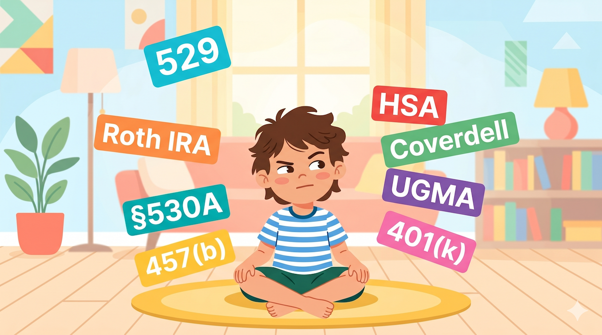

# Trump Accounts: Great Idea, Bad Product

*A classic case study in legislative product malpractice*

---

I’m a huge fan of the vision behind [Invest America](https://investamerica.org/). Giving every American child a stake in the US stock market is a noble goal, and credit to [Brad Gerstner](https://www.linkedin.com/in/bradgerstner/) and others for pulling the idea from think-tank obscurity into the real world and even a Super Bowl ad!

And yet...the product delivery is awful.

Let's dig into the newly announced 530A (aka "Trump Accounts") and see if we can dissect how such a compelling vision ultimately manifested in such a terrible product launch.

## What is a Trump Account?
Starting with the nuts and bolts: what is a Trump 530A?
- A new account type for kids - even with its own app
- If your kid was born after 2025, you get $1,000 seed - *free money!*
- Parents can contribute *after tax* money, which then grows tax free
- Accounts can receive up to $5,000 per year, $2,500 of which can come from employers
- Child gets control at age 18
- After 18, you can take withdrawals without penalty for "qualified expenses" (education, a home, starting a business) - but (like a traditional IRA) *gains are taxed as income*
- Funds are invested in a (as yet unnamed) "diversified investment vehicle designed to maximize long-term growth while minimizing risk."

## What is it good for?

The tl;dr is that unless your kid qualifies for the free money, there is really no reason to open a Trump account. And even if you do qualify for the free money, just open the account as a vehicle to collect it, but don't deposit any of your own money.

Why? Let's examine the potential investment objectives:

**Education → 529 wins outright.** 529 contribution limits are higher (gift limit of $19K and can be super-funded with 5 years of contributions) and qualified *withdrawals are completely tax-free.* Unused 529 funds can roll into a Roth IRA up to $35k. Funds can be used for any child and rolled into grandchildren accounts as well. If you are saving for education, there is no reason to use a 530A.

**First home → a plain taxable brokerage gives you way more flexibility for basically the same money.** The tax math is closer to a wash than you'd think. The brokerage's lower 15% capital gains rate, minus some annual drag from dividend taxes, lands within a percent or two of the Trump Account's tax-deferred growth taxed as ordinary income on withdrawal. At age 30 the gap is around $1,300 on a $70K portfolio — a rounding error. What the brokerage actually gives you: any investment you want, no age-18 lock-up, no "qualified expense" restriction, step-up basis at death, and the freedom to use the money for whatever your kid needs — not just home, education, or business.

**Retirement → Roth IRA dominates.** If you truly are prioritizing saving for your young child's retirement, it might make sense to use a Trump Account. But probably you are saving for education or a first house first. And even if you are saving for retirement, a more savvy strategy would be to take the $5K/year, keep it a brokerage, and then once your kid starts earning money, have them open a Roth IRA and contribute 100% of their earnings and then "gift" them the savings for the brokerage account. Yes, this is an absurdly complex strategy. But it's more effective than putting your own money into a 530A, since the withdrawals from a Roth will be tax free. 

So we have basically just reinvented a (heavily marketing and politicized) new form of a Traditional IRA without the major benefit of tax deductible contributions. 

## What done right would have looked like

And we are adding this new account type with its own new rules to the existing alphabet soup of 529s, Coverdells, IRAs, HSAs, 401(k)s, 403(b)s, UGMAs, etc... that very few people understand and fully utilize to their potential already.

We didn't need a brand new "product line." We just needed to make simple incremental improvements to existing products:

- **Expand 529s** — allow uses for first homes or starting a business.
- **Simplify ROTH IRAs** — remove the earned-income requirement.
- **Allow universal funding of either** — direct the $1,000 seed into a Roth IRA or 529, whichever the parent picks.

Three changes. No new acronym. Same political win, with clear and creative marketing. We could have achieved the vision of promoting asset ownership through plumbing that already works.

As a bit of a tangent, I loathe (I know - strong word, right?) the "secrets" of strategic tax planning like I outlined in the section above. The complexity of the account type alphabet soup leads to confusion and unnecessary reliance on middlemen who explain everything (and often sell related products). Imagine if we needed to hire professionals to regularly help us use our other important products, like phones and cars? No thanks. And by contrast, imagine what an "iPhone-like experience" would look like for saving for you and your family. It would be universal and easy to use, rather than the bespoke hodgepodge of a dozen different curiously named account types we have today. This is a detailed proposal for another day, but I want to plant the seed in the context of this case study.

## Why did the Invest America vision go off the tracks on the way to product delivery?

I don't have a clean diagnosis. But I have a few theories:

*Trump's Megalomania* 
Trump Accounts were part of the OBBBA. So surely Trump insisted having his name all over the product. Apparently, in the first draft they were to be called "Money Accounts for Growth and Advancement" - i.e. MAGA Accounts 🤦‍♂️ but then that wasn't obsequious enough so the House Republicans had to go all the way to Trump Accounts. And I imagine that Michael Dell and Salesforce and other sponsors were more excited about attaching their names to something brand new vs something that already exists.

Now - let's pause and imagine for a second the next iPhone 18 keynote. Tim Cook walks on stage and announces a new physical button on the side of the device: the Tim Cook Button. Press it and it opens an app — kind of like the App Library you already have, but slower, with worse animations, and capped at 5 apps. It would be the most ridiculed product launch in the company's history.

This is basically what happened here. But for some reason, the broad political commentariat - which is not usually shy about pointing out Trump's missteps - has been largely uncritical. Why? I think part of the answer is that attitude that "tax and finance stuff is complicated" is well entrenched into the zeitgeist and perpetuated by the financial planning industrial complex. Understanding tax and investment account strategy is something rich people pay their "people" for, not something that the average American cares about. The Tim Cook Button would get dunked on by your non-tech friends within an hour. Ship the legislative equivalent and most people glaze over before they get to the math.

But still - it is worth pointing out and asking why our norms for launching political products vs consumer products are so different.

*Politics prefers new shiny objects over improving existing "products"*
Trump is hardly the first politician to add something that is new (and redundant and confusing) rather than to improve something that already exists. Where did Coverdells come from? The 401(k)? The Roth IRA? The HSA? Each one is somebody's branded contribution to the alphabet soup, shipped by a different Congress because adding a feature is always easier than fixing one. A new account is a deliverable. Personally, I would react very positively to an advertisement announcing "exciting improvements to 529s and IRAs!" (especially if it had a catchy jingle) but I realize I might be a bit wonkier than the average super bowl viewer.

But again - we should call out the difference here with consumer products. Companies are careful to curate their product lines. Apple is not going to launch another phone called "The Golden Delicious." Why the difference? I think in large part it's because "The Tax Code" does not have strong brand affinity. It's pretty laughable to consider lines around the block at the IRS to learn about the new launch of the tax code. How could we rebrand?

*The "Abundance" problem*
The abundance crowd has been making this argument across housing, energy, and infrastructure: we've buried the ability to actually do things under decades of procedural barriers. The tax code is the same story, just less visible. Try to amend §529 to add "first home purchase" as a qualified expense and you trip the [Byrd Rule](https://en.wikipedia.org/wiki/Byrd_Rule) (which strips out any reconciliation provision deemed "merely extraneous" to budget effects), fifty state-administered plans, three committees with overlapping jurisdiction, and a CBO score nobody can agree on. Launch a new account in the same reconciliation bill and somehow that's the easier path. The procedural environment punishes refactoring and rewards greenfield — even when the greenfield product is worse.

So here we are - even with an initiative like this that is being championed by private sector leaders with plenty of experience building and launching products...we still end up with the wrong government product experience.

But Trump Accounts are a symptom, albeit a severe one. The disease is that when it comes to the tax code, we keep shipping new products when we should be simplifying and improving existing ones. We have a myriad of important issues that tax reform (or refactoring!) can help address: income inequality, healthcare access, universal wealth building. The question I'm going to keep pulling at across this series: how do we treat the disease, not just introduce more symptoms?